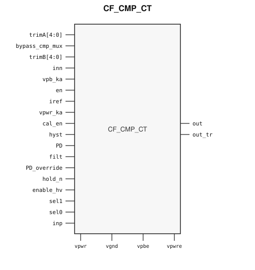

# CF_CMP_CT

> Continuous-time comparator

The public GDS is an abstract; ChipFoundry
substitutes protected full geometry at tapeout.

This package ships an SRAM-style PG wrap `CF_CMP_CT` around analog leaf
`CF_CMP_CT_core`.

## Overview

`CF_CMP_CT` is a SkyWater 130 nm hard-macro continuous-time comparator. Instantiate `CF_CMP_CT`.

Macro size is 195.12 × 120.87 µm (15 µm halo around analog leaf 165.12 × 90.87 µm).
Customer PG for chip PDN is `vpwr` / `vgnd`. Analog supplies stay wrap ports and
are routed as signals.

## Installation

```bash
pip install cf-ipm
ipm install CF_CMP_CT --version 0.2.0
```

Use `hdl/gl/CF_CMP_CT.v` as the customer blackbox, `layout/lef/CF_CMP_CT.lef`
for P&R, and `layout/gds/CF_CMP_CT.gds` / `layout/mag/CF_CMP_CT.mag` for the
public wrap. `CF_CMP_CT_core` is the analog leaf (empty Verilog, pin-only
abstract). ChipFoundry substitutes vault GDS into `CF_CMP_CT_core` at tapeout.
P&R uses the wrap LEF (`vpwr` / `vgnd` for chip PDN).

Functional sim compiles `verify/beh_model/CF_CMP_CT_core.v` **instead of** the empty `hdl/gl/CF_CMP_CT_core.v` stub. See `verify/beh_model/README.md`.

## Features

- Differential inputs `inp` and `inn`
- Outputs `out` and `out_tr`
- Enable `en` and power-down `PD`
- Analog supplies `vpwre`, `vpwr_ka`, `vpbe`, and `vpb_ka`
- Ideal Verilog behavioral model under `verify/beh_model/` for functional sim
- Customer cell `CF_CMP_CT` 195.12 × 120.87 µm (15 µm halo around analog leaf 165.12 × 90.87 µm)
- Chip PDN is `vpwr` / `vgnd`

## Pinout

Customer documentation includes a pinout of the integration cell only.
Internal schematics and architecture block diagrams are not published.



Pin names and directions match the public wrap (`layout/lef/CF_CMP_CT.lef`)
and the blackbox stub (`hdl/gl/CF_CMP_CT.v`).

## Pin Description

Directions and widths are taken from the shipped Verilog in `hdl/gl/CF_CMP_CT.v`.

| Name | Direction | Width | Description |
|---|---|---:|---|
| `trimA` | input | 5 | Trim code. Not modeled. |
| `bypass_cmp_mux` | input | 1 | Mux bypass. Not modeled. |
| `trimB` | input | 5 | Trim code. Not modeled. |
| `inn` | input | 1 | Negative analog input. |
| `vpb_ka` | input | 1 | Analog well tap. Route as a signal; not on chip PDN. |
| `en` | input | 1 | Enable. Low clears the ideal model. |
| `iref` | input | 1 | Bias current. Route as a signal; not on chip PDN. |
| `vpwr` | input | 1 | Digital supply for chip PDN. |
| `vgnd` | input | 1 | Ground for chip PDN. |
| `out` | output | 1 | High in the ideal model when inp is high and inn is low. |
| `out_tr` | output | 1 | Complement of out while the ideal model is running. |
| `vpwr_ka` | input | 1 | Analog supply. Route as a signal; not on chip PDN. |
| `cal_en` | input | 1 | Calibration enable. Not modeled. |
| `hyst` | input | 1 | Hysteresis control. Not modeled. |
| `PD` | input | 1 | Power-down. High clears the ideal model. |
| `filt` | input | 1 | Filter control. Not modeled. |
| `PD_override` | input | 1 | Power-down override. Not modeled. |
| `hold_n` | input | 1 | Active-low hold. Not modeled. |
| `enable_hv` | input | 1 | High-voltage enable. Not modeled. |
| `vpbe` | input | 1 | Analog well tap. Route as a signal and tie it to vpwre. Not on chip PDN. |
| `vpwre` | input | 1 | Analog supply. Route as a signal; not on chip PDN. |
| `sel1` | input | 1 | Select. Not modeled. |
| `sel0` | input | 1 | Select. Not modeled. |
| `inp` | input | 1 | Positive analog input. |

`CF_CMP_CT_core` also has well taps `vpb` and `vnb`. The wrap ties `.vpb(vpwr)`
and `.vnb(vgnd)`. Do not connect those pins at chip level. `vpbe` stays a wrap
port. Tie `vpbe` to `vpwre` in the customer design. Both are routed as signals,
not on chip PDN.

In OpenLane / LibreLane, hook chip PDN with
`PDN_MACRO_CONNECTIONS: "u_cf_cmp_ct vccd1 vssd1 vpwr vgnd"` and connect
`.vpwr(vccd1)`, `.vgnd(vssd1)` under `USE_POWER_PINS`. Route `inp`, `inn`,
`vpwre`, `vpwr_ka`, `vpbe`, `vpb_ka`, and `iref` onto `analog_io`.

```json
"SYNTH_ELABORATE_ONLY": true,
"SYNTH_USE_PG_PINS_DEFINES": "USE_POWER_PINS",
"FP_PDN_ENABLE_RAILS": false,
"RUN_TAP_ENDCAP_INSERTION": false,
"FP_PDN_HORIZONTAL_HALO": 10,
"FP_PDN_VERTICAL_HALO": 10,
"PDN_MACRO_CONNECTIONS": ["u_cf_cmp_ct vccd1 vssd1 vpwr vgnd"],
"MAGIC_EXT_USE_GDS": false,
"MAGIC_EXT_ABSTRACT_CELLS": ["^CF_CMP_CT_core$"],
"PRIMARY_GDSII_STREAMOUT_TOOL": "magic",
"MAGIC_MACRO_STD_CELL_SOURCE": "macro",
"MAGIC_CAPTURE_ERRORS": false,
"RUN_MAGIC_DRC": false
```

## Specifications

This macro is the catalog continuous-time comparator. No Liberty timing file
ships with this package. This README does not invent PVT tables. The ideal
model is a digital comparison of `inp` and `inn`.

## Timing Diagram

The ideal model in `verify/beh_model/` is the functional timing reference for
simulation. `PD` high clears `out` and `out_tr`. With `PD` low and `en` high,
`out` is high when `inp` is high and `inn` is low, and `out_tr` is its
complement. That model is not silicon-verified.

## Limitations and Open Issues

- Verilog in `hdl/gl/CF_CMP_CT.v` is a structural wrap around an empty
  `CF_CMP_CT_core` blackbox. Functional sim uses `verify/beh_model/CF_CMP_CT_core.v` (ideal model, not SPICE).
- Liberty is not in this package. P&R uses the wrap LEF.
- Trim, hysteresis, calibration, filter, and mux behavior are not modeled.

## Release History

| Version | Date | Notes |
|---|---|---|
| 0.2.0 | 2026-09-28 | First SRAM-style PG-wrapped package. Ideal behavioral model. Core fill-exclude covers. |

## Tapeout History

This hard macro has high-volume commercial production history (millions of
units). Catalog and IPM maturity is Production. ChipFoundry substitutes
protected full layout at tapeout. The chipIgnite delivery of this package is
not marked shuttle-proven until a run returns.
